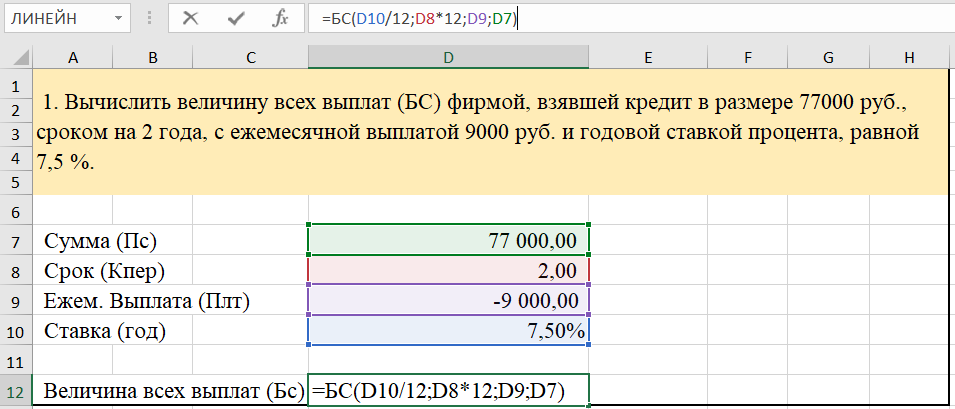

# Финансовые функции в Excel

**Цель работы:** научиться использовать финансовые функции Excel при экономических расчётах.

**Пример задачи:**
Вычислить величину всех выплат (БС) фирмой, взявшей кредит в размере 77 000 руб., сроком на 2 года, с ежемесячной выплатой 9 000 руб. и годовой ставкой процента, равной 7,5 %.
